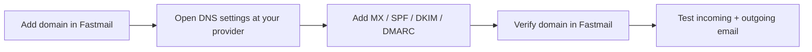

# How to Connect Fastmail to a Custom Domain

A practical guide for using Fastmail with a domain you already own (bought from GoDaddy, Dynadot, Hostinger, Cloudflare, Namecheap, or any other registrar).

This guide only adds **email** DNS records. It does not touch your website's existing DNS records (A records, CNAME for your site, etc.).

---

## 1. What You Need

* A domain name you own and can manage DNS for.
* Login access to your DNS provider (registrar or DNS host).
* A Fastmail account (any paid plan that supports custom domains).
* A few minutes for DNS changes, plus wait time for propagation.

---

## 2. Add the Domain to Fastmail

1. Log in to Fastmail.
2. Go to **Settings → Domains**.
3. Click **Add or buy domain**.
4. Choose **"I already own this domain"** and enter your domain name.
5. Fastmail will show you the DNS records you need to add.

Keep this Fastmail page open in one tab — you'll copy values from it in the next steps.

---

## 3. Open DNS Settings

Go to your domain's DNS management page. This is usually called **DNS**, **DNS Management**, **DNS Zone**, or **Advanced DNS**, depending on the provider.

Open it in a second browser tab so you can copy values from Fastmail and paste them here.

---

## 4. Add MX Records

**MX (Mail Exchange)** records tell the internet which mail servers handle email for your domain.

Steps:

1. In Fastmail's domain setup page, copy the MX records shown (host/priority/value).
2. In your DNS provider, add each MX record exactly as shown.
3. **Remove any existing MX records** for the domain that point elsewhere (e.g. leftover records from a previous email provider or from your registrar's default parking page). A domain should only have the MX records for the mail provider you're actually using.

| Type | Host | Priority | Value | Notes |
|------|------|----------|-------|-------|
| MX   | @    | (from Fastmail) | (from Fastmail) | Copy exact values from Fastmail |

Do not guess these values — always copy them directly from your Fastmail domain setup screen, since they can change.

---

## 5. Add SPF

**SPF (Sender Policy Framework)** is a TXT record that lists which servers are allowed to send email for your domain. It helps prevent spoofing and improves deliverability.

Steps:

1. Copy the SPF value shown in Fastmail (a TXT record on `@`, usually starting with `v=spf1`).
2. Check if a TXT record starting with `v=spf1` already exists for your domain.
   * If one exists, **do not add a second SPF record** — a domain can only have **one** SPF TXT record. Merge Fastmail's required part into the existing one instead of creating a new record.
   * If none exists, add Fastmail's SPF value as a new TXT record.

---

## 6. Add DKIM

**DKIM (DomainKeys Identified Mail)** signs your outgoing emails with a cryptographic key so receiving servers can verify the message really came from your domain and wasn't altered.

Steps:

1. In Fastmail's domain setup page, copy the DKIM records (usually CNAME records).
2. Add each one to your DNS provider exactly as shown, using the exact host/name and value from Fastmail.
3. Do not shorten or rewrite the values — DKIM values are case-sensitive and must match exactly.

---

## 7. Add DMARC

**DMARC (Domain-based Message Authentication, Reporting and Conformance)** tells receiving mail servers what to do with emails that fail SPF/DKIM checks (reject, quarantine, or allow), and where to send reports.

Steps:

1. Copy the DMARC TXT record Fastmail recommends (usually on `_dmarc.yourdomain.com`).
2. Add it to your DNS provider.
3. Review the policy value (`p=none`, `p=quarantine`, or `p=reject`):
   * `p=none` — monitor only, safest starting point.
   * `p=quarantine` — failing mail goes to spam.
   * `p=reject` — failing mail is blocked outright.
4. Start with `p=none` if you're unsure, then tighten it later once you confirm mail is flowing correctly.

---

## 8. Verify the Domain

1. Go back to Fastmail's domain setup page.
2. Click **Verify** / **Recheck DNS**.
3. Fastmail will check MX, SPF, and DKIM and show a green checkmark for each once correctly detected.
4. If something fails, double check the exact record type, host, and value against what Fastmail shows — a common mistake is a typo or an extra `.` at the end of a host name.

---

## 9. Test Email

Once verification passes:

1. **Incoming:** Send a test email from another account (e.g. Gmail) to your new address. Confirm it arrives in Fastmail.
2. **Outgoing:** Send a test email from Fastmail to an external address (e.g. Gmail). Confirm it arrives and isn't marked as spam.
3. Optionally check the message headers on the received email to confirm SPF and DKIM both show `pass`.

---

## 10. Important DNS Rules

* **Only one SPF record per domain.** Multiple SPF TXT records break SPF entirely — merge them instead.
* **Remove conflicting old MX records** before adding new ones, or mail delivery will be inconsistent.
* **Copy values exactly from Fastmail** — don't hardcode or reuse values from another guide, screenshot, or domain. Fastmail's values can be account-specific.
* **DNS propagation takes time.** Changes can take anywhere from a few minutes up to 24–48 hours to fully propagate, depending on TTL and your provider.
* **Don't touch unrelated records.** Leave your website's A/CNAME/other records alone — only add or edit the mail-related records (MX, SPF, DKIM, DMARC).
* If your DNS is hosted somewhere other than your registrar (e.g. Cloudflare in front of a GoDaddy domain), make changes in the place that's actually authoritative for DNS.

---

## 11. Common DNS Provider Locations

| Provider    | Where to find DNS settings |
|-------------|------------------------------------------------|
| GoDaddy     | My Products → Domain → DNS → Manage DNS Records |
| Namecheap   | Domain List → Manage → Advanced DNS |
| Cloudflare  | Select domain → DNS → Records |
| Hostinger   | Domains → Manage → DNS / Name Servers |
| Dynadot     | My Domains → select domain → DNS settings |

Menu names change over time — if you can't find it, search for "DNS", "Zone", or "Advanced DNS" in your provider's dashboard.

---

## 12. Final Checklist

* [ ] Domain verified in Fastmail
* [ ] MX configured
* [ ] SPF configured
* [ ] DKIM configured
* [ ] DMARC reviewed
* [ ] Incoming email tested
* [ ] Outgoing email tested
* [ ] SPF/DKIM authentication passes

**Setup complete:** ✅

